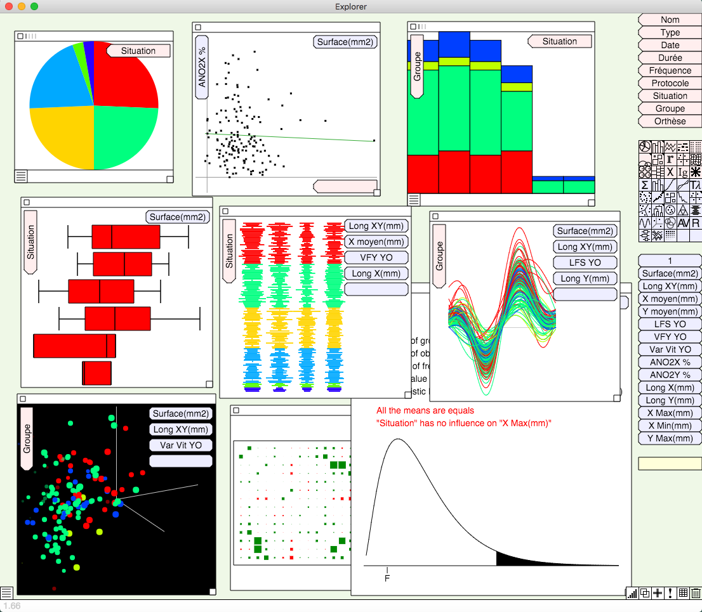
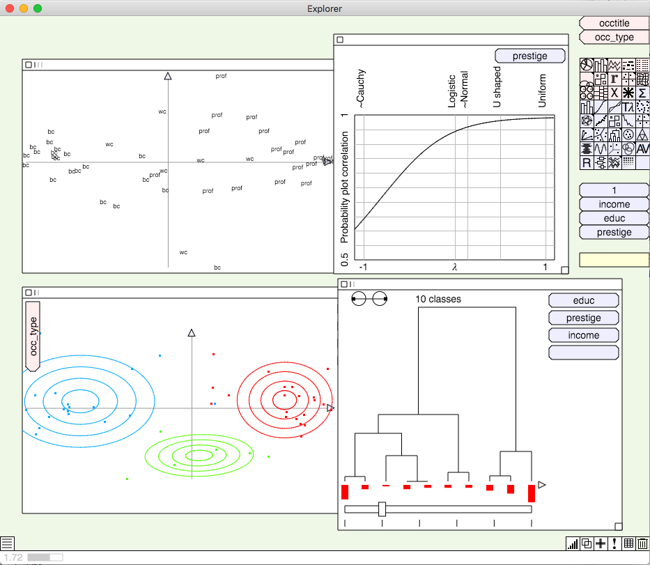
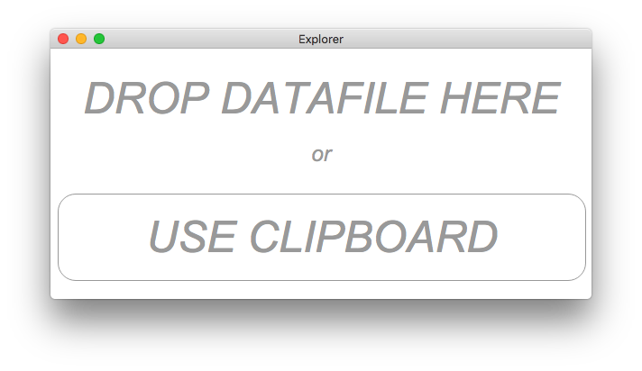
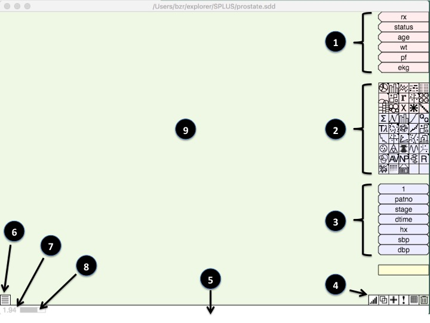
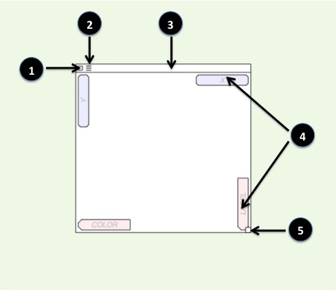
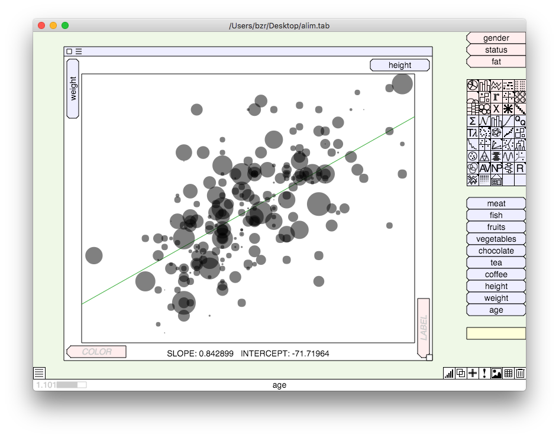

# Presentation

This Explorer allows to perform various statistical analyses and data mining operations in a very easy and intuitive way. As the name implies, this software aims at exploring data and getting quick insight of the order of magnitude of the observed objects. That's why it does focus on graphical representation and mouse driven operations, unlike the traditional statistical tools cluttered with numerous dialog boxes and lists with five decimal figures. You can, however, have the detailed numbers once your analysis is completed.

## Videos

<table>
<tr>
	<td>Overview</td>
	<td align="center">
		<a href="http://www.dailymotion.com/video/x39lwif_data-explorer-demo_tech" title="watch on dailymotion">
			</img>
		</a></td>
	<td align="center"> 
		<a href="https://youtu.be/S0pAdZcNnj4" title="watch on youtube">
			</img>
		</a></td>
</tr>
<tr>
	<td> Contingency table</td>
	<td align="center">
		</td>
	<td align="center">
		<a href="https://www.youtube.com/watch?v=6hUlluoQOd8" title="watch on youtube">
			</img>
		</a></td>
</tr>
</table>

## Screenshots

- [Installation and run](#installation-and-run)
- [Data loading](#data-loading)
- [Main window](#main-window)
- [Graph](#graph)
- [Tools](#tools)
- [Selection](#selection)
- [Conversions](#conversions)
- [Units](#units)
- [Types of analyses](#types-of-analyses)
- [In the browser](#in-the-browser)
- [Contact](#contact)

## Installation and run

The Explorer is written in javascript and built with [electron](http://electron.atom.io),

##### OSX
Download the latest version for darwin from [the release page](https://github.com/jfbouzereau/explorer/releases). 

##### Windows
Download the latest version corresponding to your system (32bit or 64bit) from [the release page](https://github.com/jfbouzereau/explorer/releases). The application is bundled into a single exe file, thanks to [BoxedApp Packer](http://www.boxedapp.com/boxedapppacker/index.html) .

##### Linux
Download [electron](https://github.com/atom/electron/releases) for linux, download the source of the Explorer from [the release page](https://github.com/jfbouzereau/explorer/releases), copy the app folder into electron/resources, then run Electron.

## Data loading

At launch time, the Explorer shows a window to choose the dataset to use. You can either drag and drop a file from your computer desktop, or click the clipboard button.

Various file formats are accepted :

<table border="0">
<tr>
	<th>Source</th>
	<th>File extension</th>
	<th>Remarks</th>
	
</tr>
<tr>
	<td>Access</td>
	<td>mdb , accdb</td>
	<td>Access 2000 or higher</td>
</tr>
<tr>
	<td>BigQuery</td>
	<td>*</td>
	<td>A config file with a content like this:  
BigQuery  
client_secret:/full/path/to/my_private_key.json  
query:select * from lookerdata:cdc.project_tycho_reports limit 1000  
timeout:60000  
	</td>
</tr>
<tr>
	<td>dBase</td>
	<td>dbf</td>
	<td></td>
</tr>
<tr>	
	<td>Excel</td>
	<td>xlsx</td>
	<td>The names of the fields are expected at the top of the columns</td>
</tr>
<tr>
	<td>JMP</td>
	<td>jmp</td>
	<td></td>
</tr>
<tr>
	<td>JSON file</td>
	<td>*</td>
	<td>A JSON array of records</td>
</tr>
<tr>
	<td>LIMDEP / NLOGIT</td>
	<td>lpj</td>
	<td></td>
</tr>
<tr>
	<td>MINITAB</td>
	<td>mtw</td>
	<td></td>
</tr>
<tr>
	<td>MLwiN</td>
	<td>ws</td>
	<td>Uncompressed format only</td>
</tr>
<tr>
	<td>Mysql</td>
	<td>*</td>
	<td>A config file with a content like this:

mysql  
host:192.168.0.2  
user:bob  
password:secret  
database:test  
query:select * from mytable  

	</td>
</tr>
<tr>
	<td>Postgres</td>
	<td>*</td>
	<td>A config file with a content like this:

postgres  
host:192.168.0.2  
user:bob  
password:secret  
database:test  
query:select * from mytable  

or: 

postgres  
connection:bob:secret@192.168.0.2/test  
query:select * from mytable  

	</td>
</tr>
<tr>
	<td>R</td>
	<td>rdb</td>
	<td>Binary format only</td>
</tr>
<tr>
	<td>SAS</td>
	<td>sas7bdat</td>	
	<td>Uncompressed format only</td>
</tr>
<tr>
	<td>SPLUS</td>
	<td>sdd</td>
	<td></td>
</tr>
<tr>
	<td>SPSS</td>
	<td>sav</td>
	<td>Uncompressed format only</td>
</tr>
<tr>
	<td>Stata</td>
	<td>dta</td>	
	<td>Stata 8 or higher</td>
</tr>
<tr>	
	<td>Tabular file</td>
	<td>*</td>
	<td>The names of the fields are expected on the first line</td>
</tr>
<tr>
	<td>Web file</td>
	<td>*</td>
	<td>Contains the url of the data. The remote file must be in one of the previous formats</td>
</tr>
</table>

If you click the clipboard button, the data must be in tabular form, with the name of the fields on the first line. 

## Main window

Once the data have been successfully loaded, the main window is displayed :

Here are the elements of the interface :

  1. List of the categorical fields (aka "the pink zone"). By default only 10 fields are displayed. To resize the list, move the mouse just below the list and drag to shrink or extend the list.
  
  2. Icons of the existing analyses (graphs). To run a new analysis, just drag its icon to the workspace.  
  
  3. List of the numerical fields (aka "the blue zone"). By default only 10 fields are displayed. To resize the list, move the mouse just below the list and drag to shrink or extend the list.
  
  4. Icons of the tools
  
  5. Status bar. This area gives at any time details about the object under the mouse, or the action your are about to do.
  
  6. Dock This area is used to keep graphs that are temporarily removed from the workspace.
  
  7. Version number
  
  8. Memory usage
  
  9. Workspace. This area is where the graphs are created and arranged.
  
  
  
## Graph

To create a new graph, drag its icon to the workspace. Alternatively if you dont know which icon to look at, you can right-click or control-click on the workspace to get a menu with all the possible analyses.

A graph is represented by an area with different noticeable parts :

  1. Close box. Click on this box to close the graph. All the computations done will be lost.
  
  2. Option menu. Some graphs have different ways of representing the results. In that case   click on this sign to bring up the menu to choose from. Alternatively, right-click or control-click within the graph.
  
  3. Title bar. This area shows the current selection (see below). Click on this area to drag the graph around. 
  
  4. Slots. These are the places where you can define the parameters of the analysis. Depending on the graph, different combinations of slots are shown. On a pink slot you can drag a categorical field. On a blue slot you can drag a numerical slot. Parameters can be swapped by dragging from one slot to another one ( of the same graph, and of the same color ).
  
  5. Resize box. Click on this box and drag to resize the graph.
  
  
To change the type of a graph, drag the icon of the new type onto the graph. The new analysis will retain the parameters and selection of the previous one.
  
## Selection
 
Every analysis can be restricted to a part of the data only. The set of observations (records) currently processed by a graph is named the selection, and is displayed in the title bar .
Initially, the selection consists of all the observations, and the title is blank.

##### Selection based on a categorical field
* Use a type of graph that allows to split the dataset into the desired groups : pie chart, bar chart, treemap.
* Drag the slice of the group to be processed out of the graph, onto the workspace.
* This creates a new pie chart with a selection equal to the slice's category.
* Drag the icon of the wanted analysis onto this second graph. It will change its type, but will retain the selection. The type of graph can be changed as many times as wished, all the analyses will be conducted on the same selection.

Conversely, the selection of an existing graph can be changed by dragging a pie slice onto its
title. This allows to conduct successively the same analysis on different parts of the data.

##### Selection based on a numerical field
* Drag a numerical field from the blue zone to the title of an existing graph. The selection will consists of all the observations with a non-null value of the field. Typically a dummy variable (with values 0 or 1) would be used for this, but not necessarily.

##### Combining selections
Dragging a slice to the title of a graph which already has a selection will combine the two
sets. 

If the two variables are the same, the resulting selection will be the union of the two sets. Example: a pie graph splits the data into Apples, Pears, Peaches, and Apricots. If you drag the apple slice to the title of another graph, the selection will be Apples. If you then drag the peach slice to the title of the graph, the selection will be Apples + Peaches

If the two variables are not the same, the resulting selection will be the intersection of the two sets. Example : a pie graph splits the data into Apples, Pears, Peaches and Apricots. If you drag the apple slice to the title of another graph, the selection will be Apples. If you change the variable defining the pie to split the data into Organic and Non-Organic, and drag the Organic
slice to the title of the second graph, the selection will be Apples AND Organic.

## Conversions
When loading the data, the Explorer identifies fields containing only numbers as numeric, and all others fields as categorical. Sometimes it is desirable to change this. Several possibilities exist.

* Drag a numerical field to the pink zone. The field is converted to categorical, the values are the same but as  strings of characters.

* Drag a categorical field to the blue zone. Each category gives a dummy variable of the same name, Therefore, there are as many dummies as categories of the initial field, and all the dummies are exclusive. Example : COLOR is the categorical field converted:

Original data:
<table>
<tr><td>ID</td><td>COLOR</td></tr>
<tr><td>1</td><td>Blue</td></tr>
<tr><td>2</td><td>Red</td></tr>
<tr><td>3</td><td>Green</td></tr>
<tr><td>4</td><td>Red</td></tr>
</table>

Data after the conversion
<table>
<tr><td>ID</td><td>Blue</td><td>Red</td><td>Green</td></tr>
<tr><td>1</td><td>1</td><td>0</td><td>0</td></tr>
<tr><td>2</td><td>0</td><td>1</td><td>0</td></tr>
<tr><td>3</td><td>0</td><td>0</td><td>1</td></tr>
<tr><td>4</td><td>0</td><td>1</td><td>0</td></tr>
</table>

* Drag the special numerical field "1" to the pink zone. This "pivots" the data. Each numerical field becomes a category of a new PIVOT field, whose value is in a new COUNT field.
Each original record gives as many records as the number of numerical fields. Example: HEIGHT, WIDTH and DEPTH are the numerical fields.

Original data :
<table>
<tr><td>ID</td><td>COLOR</td><td>HEIGHT</td><td>WIDTH</td><td>DEPTH</td></tr>
<tr><td>1</td><td>Blue</td><td>142</td><td>25</td><td>11</td></tr>
<tr><td>2</td><td>Red</td><td>175</td><td>12</td><td>16</td></tr>
<tr><td>3</td><td>Green</td><td>109</td><td>48</td><td>14</td></tr>
</table>
	
Data after the pivot :
<table>
<tr><td>ID</td><td>COLOR</td><td>PIVOT</td><td>COUNT</td></tr>
<tr><td>1</td><td>Blue</td><td>HEIGHT</td><td>142</td></tr>
<tr><td>1</td><td>Blue</td><td>WIDTH</td><td>25</td></tr>
<tr><td>1</td><td>Blue</td><td>DEPTH</td><td>11</td></tr>
<tr><td>2</td><td>Red</td><td>HEIGHT</td><td>175</td></tr>
<tr><td>2</td><td>Red</td><td>WIDTH</td><td>12</td></tr>
<tr><td>2</td><td>Red</td><td>DEPTH</td><td>16</td></tr>
<tr><td>3</td><td>Green</td><td>HEIGHT</td><td>109</td></tr>
<tr><td>3</td><td>Green</td><td>WIDTH</td><td>48</td></tr>
<tr><td>3</td><td>Green</td><td>DEPTH</td><td>14</td></tr>
<table>

## Units
* All the analyses applied to categorical fields (whose icon is pink) count the observations. For example in a pie chart the slices are proportional to the number of observations of each category. Sometimes the counts have to be weighted. This is done by changing the "unit" of the graph, by dragging a numerical field onto the graph. The title of the graph is turned blue to indicate that the counts are weighted. The status bar also shows the values or percentages in the new unit. To remove the unit and go back to the normal counting, drag the special field "1" onto the graph. 

* All the analyses that represents datapoints in a 2D plane ( scatter plot, PCA, discriminant analysis, ternary plot, etc) can also be modified. If a numerical field is set as unit, the datapoints are displayed as circles whose size is proportional to the unit :

## Tools

Here are the various tools proposed by the toolbar at the bottom of the screen :

* Sort : drag this icon onto a field, or drag a field onto this icon to sort the data in ascending order. Do the same sort again to sort in descending order. The sort is stable : to sort the data by a key consisting of field1,field2,field3,  you must sort by field3 first, then field2, and finally field1.

* Clone. Drag this icon onto a graph to get a copy of it, with the same parameters. If the computation is slow, this allows to bypass the second computation.

* Add : Drag this icon to the pink or blue zone to create a new field. See below.

* Help. Drag this icon onto a graph to get some informations about the analysis, the results produced,  the representation options, and the possible actions.

* Table : Drag this icon to the pink or blue zone to get a table of the values of the dataset.
Drag this icon onto a graph to get a table of the numerical results. They can be copied and pasted into another software.

* Dustbin : Drag this icon onto a field, or drag a field onto this icon to delete the field from the dataset in memory. The original input file is not modified. If the field is in use by any graph, it cannot be deleted.

## Types of analysis
* Pie chart
* Bar chart
* Line chart
* Association diagram
* Word cloud
* Arc diagram
* Contingency table
* Multiple Correspondence analysis
* 3-variable graph
* Treemap
* Chi-2 tests
  * Pearson' chi-square test
  * Yates' chi-square test
  * G-test
  * Fisher's exact test
* Gini impurity
* Entropy
* Repartition curve
* Distribution curve
* Scatter plot
* Ternary plot
* Andrew's curves
* Survey plot
* 3D plot
* Correlations
* Autocorrelation plot
* Probability plot
* Tukey-lambda PPCC plot
* Lag plot
* General statistics
* Normality tests
  * Shapiro-Wilk test
  * Anderson-Darling test
  * Lilliefors test
  * D'Agostino test
  * Anscombe test
  * Omnibus test
  * Jarque-Bera test
* Analysis of variance
  * Bartlett's test
  * F-test
  * Levene test
  * Brown Forsythe test
  * Box's M test
  * Student's T-test
  * Welch T-test
  * Hotelling's test
  * Wilk's lambda
  * Lawley-Hotelling trace
  * Pillai trace
  * Two-way anova
* Non-parametric tests
  * Kolmogorov-Smirnov test
  * Kruskal-Wallis test
  * Jonckheere test
  * Cochran Q test
  * Durbin test
  * Friedman test
  * Mantel-Haenszel test
  * Breslow-Day test
  * Woolf test
* Principal components
* Canonical correlation analysis
* K-means
* K-medoids
* Fuzzy C-means
* Huen diagram
* Dendogram
* Radviz
* Discriminant analysis
* Regressions
  * Linear regression
  * Poisson regression
  * Negative binomial regression
  * Logistic regression
  * Least angle regression
* Influence plot
* QQ plot
* Box plot
* Parallel coordinates

## In the browser

The Explorer can also be executed in any modern browser. Open app/index.html, 
paste the data from the clipboard, and click OK.

## Contact

jfbouzereau&#064;netcourrier.com
